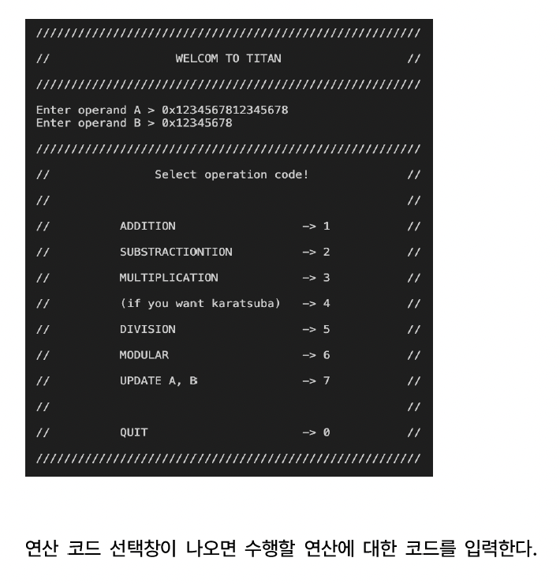
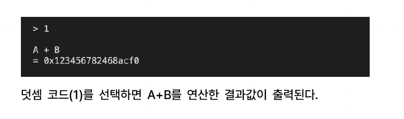
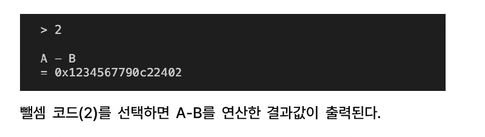
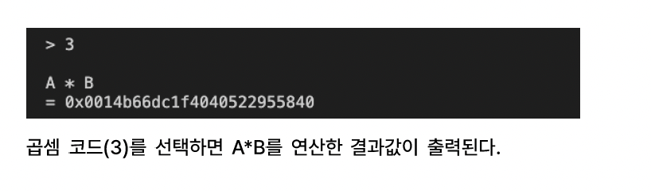
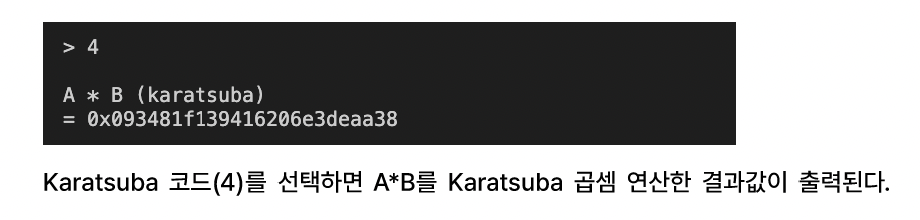
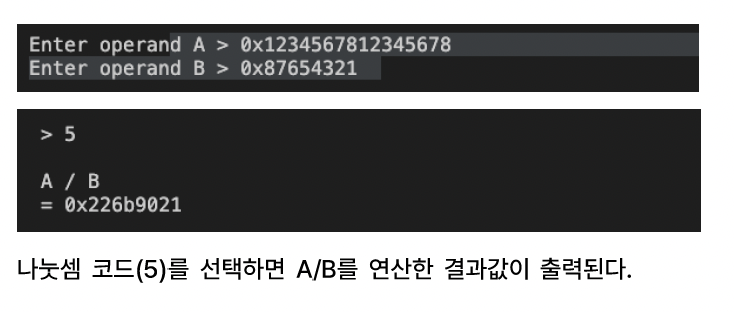
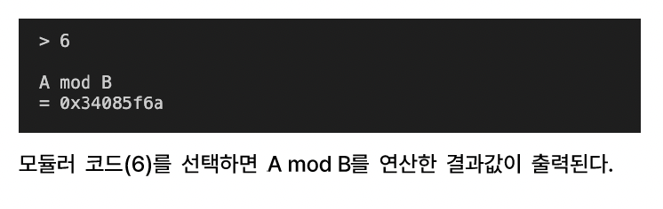
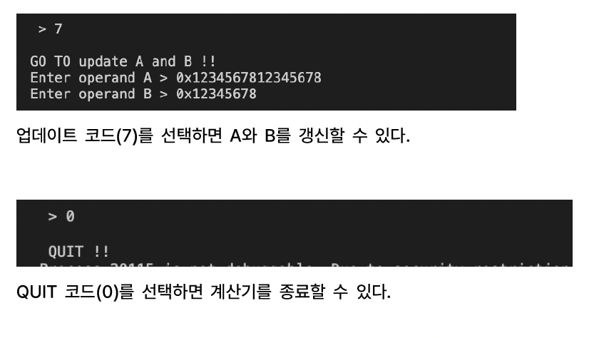

## 🧮 TITAN_calculator 사용법

`TITAN_calculator`는 16진수(Big Integer) 연산을 위한 콘솔 기반 계산기입니다. 피연산자 A, B를 입력받아 다양한 산술 연산을 수행할 수 있습니다.

### 🔢 입력 형식
- A와 B는 `0x1234...`와 같은 **16진수** 형식으로 입력해야 합니다.

---

### 💡 사용 예시

#### ▶️ 프로그램 시작 화면 및 연산 선택

---

#### ➕ 덧셈 (1번 선택 시 A + B)

---

#### ➖ 뺄셈 (2번 선택 시 A - B)

---

#### ✖️ 곱셈 (3번 선택 시 A * B)

---

#### ⚡ Karatsuba 곱셈 (4번 선택 시 고속 곱셈 알고리즘)

---

#### ➗ 나눗셈 (5번 선택 시 A / B)

---

#### 🧮 모듈러 연산 (6번 선택 시 A mod B)

---

#### 피연산자 업데이트 (7번 선택 시 A, B 재입력) 종료 (0번 선택 시 계산기 종료)

---

### ✅ 연산 코드 요약

| 코드 | 연산         |
|------|--------------|
| 1    | ADDITION     |
| 2    | SUBTRACTION  |
| 3    | MULTIPLICATION |
| 4    | Karatsuba MULTIPLICATION |
| 5    | DIVISION     |
| 6    | MODULAR      |
| 7    | UPDATE A, B  |
| 0    | QUIT         |
